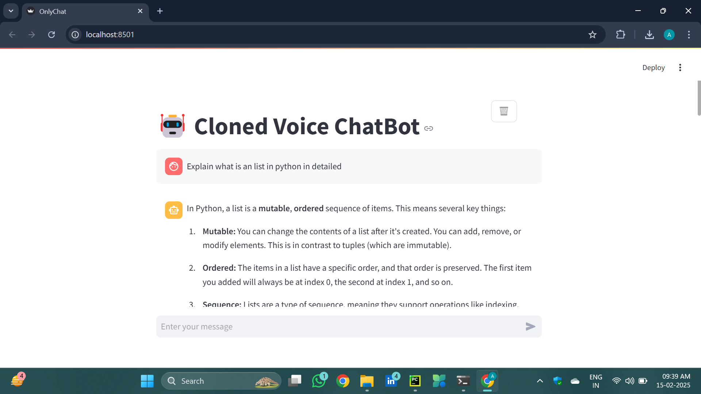
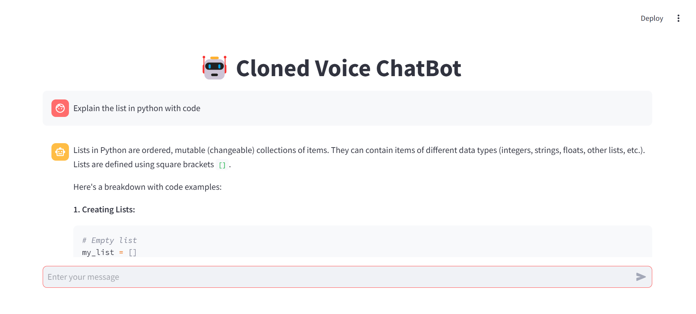
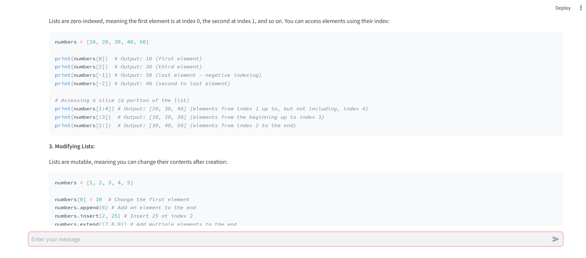
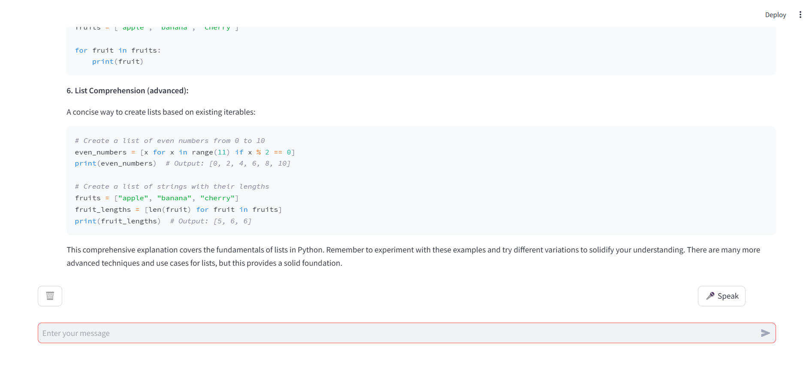

# 🎙️ Cloned Voice ChatBot with Speech Recognition and AI Responses

An AI-powered interactive chatbot built using **Streamlit**, **Google Speech Recognition API**, and **Gemini AI**, enabling real-time **voice-to-text interaction** and **intelligent conversational responses**.

Designed to simulate natural human interaction with cloned voice input, this chatbot serves as an innovative AI application integrating **NLP**, **speech processing**, and **modern UI/UX design**.

---

## 🚀 Project Highlights

- 🔊 **Real-Time Voice-to-Text**: Converts user speech into text with high accuracy using Google Speech Recognition API.
- 🤖 **AI-Driven Conversations**: Utilizes Gemini AI for generating intelligent, contextual responses.
- 💬 **Chat History Management**: Intuitive Streamlit interface with clear chat, reset functionality, and visual message logs.
- 🎧 **Noise Filtering**: Tuned for ambient noise handling to ensure better speech recognition in real-world environments.
- ⚙️ **Modular Python Scripts**: Clean, readable, and scalable code structure for easy enhancements and deployment.

---

## 🧠 Tech Stack

| Category          | Tools / Technologies                         |
|------------------|----------------------------------------------|
| Programming      | Python                                       |
| Libraries        | Streamlit, OpenAI/Gemini API, SpeechRecognition |
| API              | Gemini AI                                    |
| UI/UX            | Streamlit Frontend                           |
| Tools            | Git, GitHub                                  |

---

## 🎓 Ideal For

- Academic research in **Human-AI interaction** and **Speech Interfaces**
- Showcase in **job interviews** to demonstrate practical AI application skills
- Portfolio enhancement for **Data Science** and **AI Engineering** roles

---

## 🛠️ Features To Explore

- 🔄 Integrate Text-to-Speech for AI voice responses
- 🧠 Enhance NLP using transformers (e.g., BERT, GPT)
- 📊 Collect usage analytics for model improvement

---
## 📷 Screenshots

